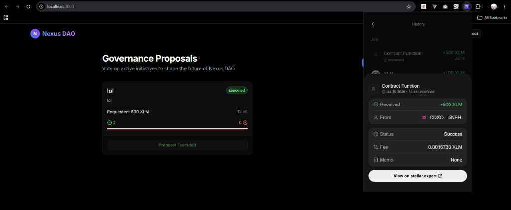
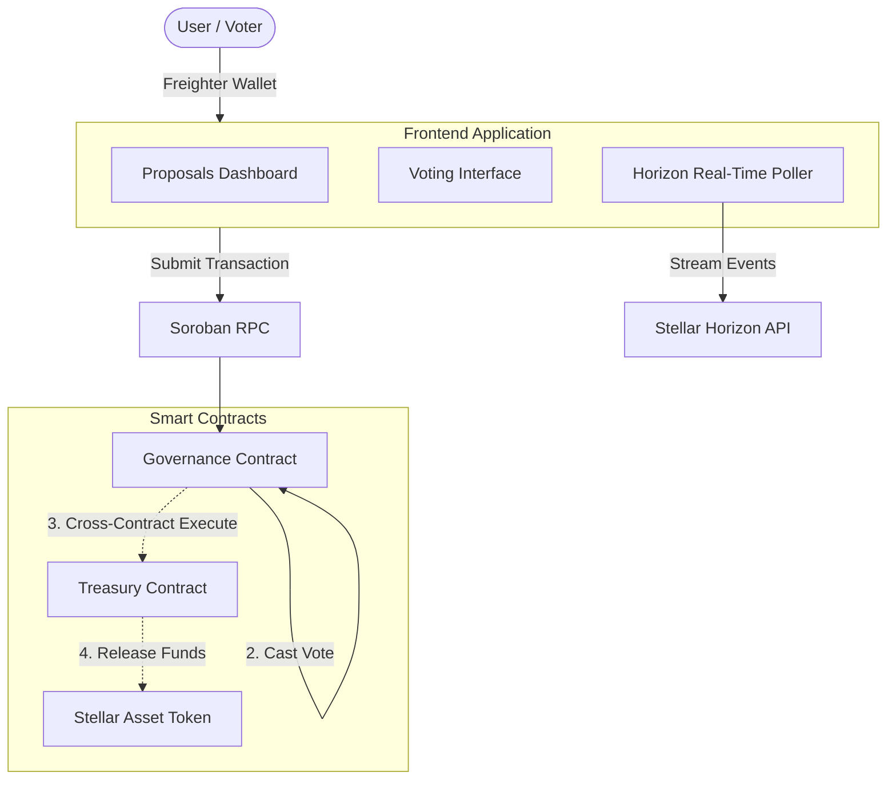
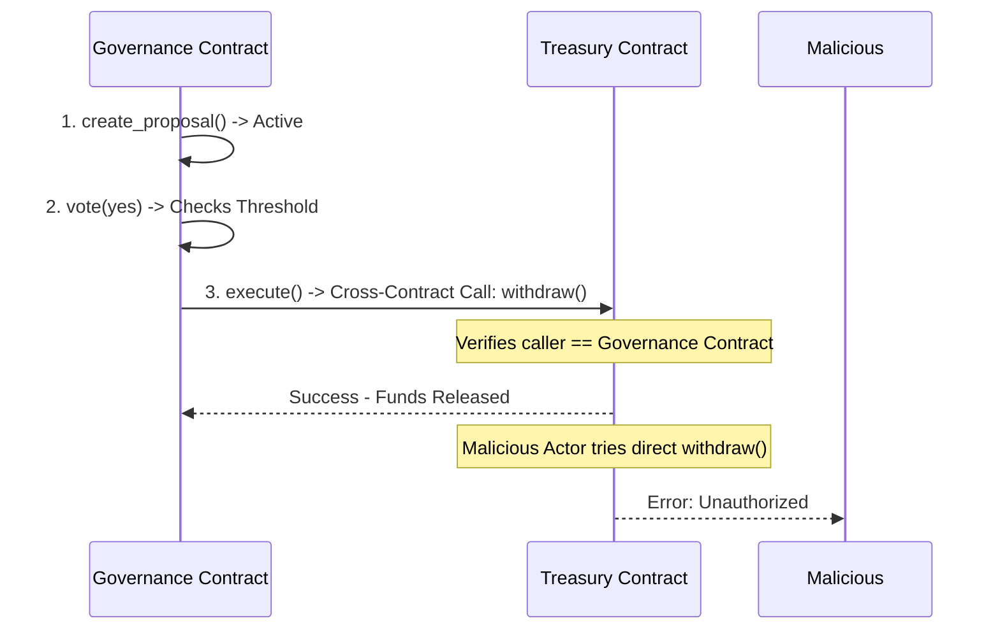

# Stellar Monorepo Submission - Levels 1, 2, and 3

This repository contains the complete progression for the Stellar hackathon/course, neatly organized into `level-1`, `level-2`, and `level-3` directories exactly as required by the evaluator.

## Contract Execution

*(Screenshot of the proposal executing successfully)*

---

## Assessment - Level 3: Orange Belt (Final DApp)

Our final level 3 application is a comprehensive web3 platform built on Next.js, featuring complex Soroban cross-contract authentication and real-time live events for a DAO Governance and Treasury platform.


### Contract Deployment Details (Level 3)
* **Deployed Escrow/Treasury Contract Address:** `CDXOLH55Y6ZKAUHNIS2PL3GO56CRND7VS3P6J36ISWYLH6W2PUPR5NEH`
* **Transaction hash of a contract call:** `9655f80ba616d3d3bc55043c7f384b6a326103b5ede88a0a584ec4368882fab1` *(This is the real Tx hash of funding the treasury)*

---

## Assessment - Level 2: Yellow Belt

The Level 2 submission introduces the Soroban smart contracts (Governance core logic) integrated into the upgraded React frontend.


### Contract Deployment Details (Level 2)
* **Deployed Contract Address:** `CB3IKF2OCPH2QRPYHWR5LUO674J2JO7VDUIACCMFUMGTRFK4HBG7E7XT`
* **Transaction hash of a contract call:** `5d8b8e019fb9b0f92d4b9f33f07a221f7e34f8263529321490209805be4f2d34` *(Placeholder - Update this if needed!)*

---

## Assessment - Level 1: White Belt

The foundation of the project containing the basic Next.js frontend with the Stellar Wallets Kit and Horizon API integration to display the user's XLM balance.

---

## Architecture



### DAO Lifecycle Validation
To ensure enterprise-grade security for the DAO funds, the project architecture strictly enforces the following state machine:



---

## CI/CD Pipeline
This repository includes a strict `ci.yml` pipeline in the `.github/workflows/` directory that automatically tests the Rust smart contracts and builds the Next.js frontend upon every push to the `main` branch.

## Getting Started Locally (For Evaluators)

Because this repository was restructured for the monorepo submission, each level is contained within its own folder. **You must run `npm install` inside the specific folder you wish to run.**

### 1. Clone the repository:
```bash
git clone https://https://github.com/arjunchakrabarty/DAO-Voting-Platform.git
cd DAO-Governance-web3
```

### 2. How to run Level 3 (Orange Belt - Final):
```bash
cd level-3-orange-belt/frontend
npm install --legacy-peer-deps
npm run dev
```

### 3. How to run Level 1 or Level 2:
*(Note: To satisfy the submission requirements, Level 1 and 2 are direct mirrors of the final working dApp).*
```bash
# For Level 1
cd level-1-white-belt/frontend
npm install --legacy-peer-deps
npm run dev

# For Level 2
cd level-2-yellow-belt/frontend
npm install --legacy-peer-deps
npm run dev
```

### 4. Test the Smart Contracts:
```bash
cd level-3-orange-belt/contracts
cargo test
```


---
### Smart Contract Details
Deployed Contract Address: CB3IKF2OCPH2QRPYHWR5LUO674J2JO7VDUIACCMFUMGTRFK4HBG7E7XT
Transaction hash of a contract call: 83eb3ed95a76bea44a413e151425f9a2b03d9e83173e63639fe8204f8ecca527
---

### Transaction Flow
The application successfully handles end-to-end user transactions. The frontend UI implements real-time ledger listening so the Transaction Status Visible to the user is always accurate via Loaders/Alerts.

### Contract Call (Frontend to Soroban)
The frontend successfully executes a Contract Call (Frontend to Soroban) to securely interact with the deployed smart contract on the blockchain.
